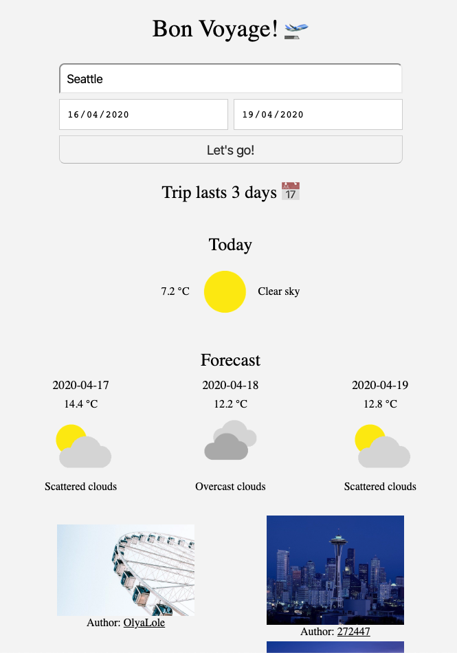

# Natural Language Processing (NLP) API Udacity's front end nanodegree project

This project lets you plan a trip and uses [Geonames](https://www.geonames.org/), [Weatherbit](https://www.weatherbit.io/), and [Pixabay](https://pixabay.com/) APIs to provide information about the destination.

## How to run it

Follow these steps:

- Clone this repo
- Install dependencies with npm install.
- Create account and API keys for the following APIs:
   - [Geonames](https://www.geonames.org/)   
   - [Weatherbit](https://www.weatherbit.io/)
   - [Pixabay](https://pixabay.com/)
- For development environment:
   - Open src/server/index.js and make sure the root GET endpoint its configured to server your client index.html file
   - Run `npm run build-dev` in one terminal.
   - Run `npm start` in another terminal
   - Open src/server/index.js and make sure the root GET endpoint its configured to server your **client** index.html file.
   - Open your localhost at port 8081
- For production environment:
   - Open src/server/index.js and make sure the root GET endpoint its configured to server your **dist** index.html file
   - Run `npm run build-prod`
   - Run `npm start` and open your localhost at port 8081

## Tests

To run the test suite execute the command `npm test`. Tests are written with Jest.

## Extended features

I implemented the additional features:
- Display length of trip
- Pull forecast for multiple days
- Incorporate weather icons